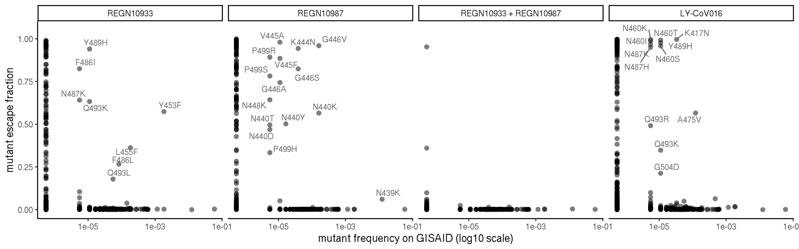
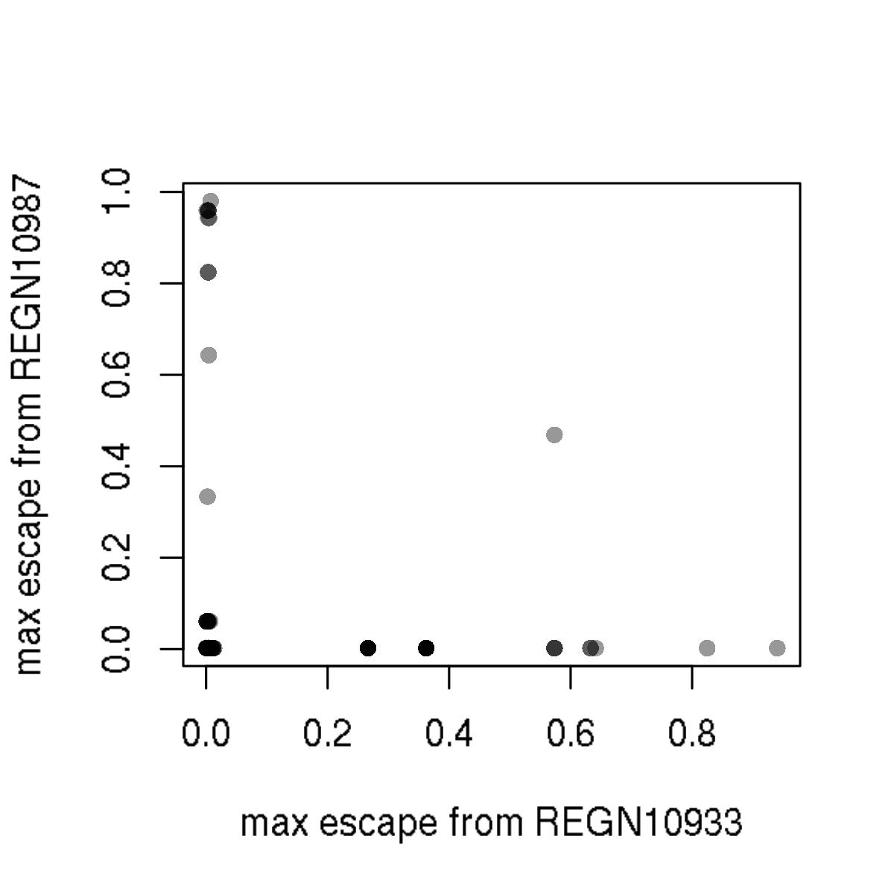
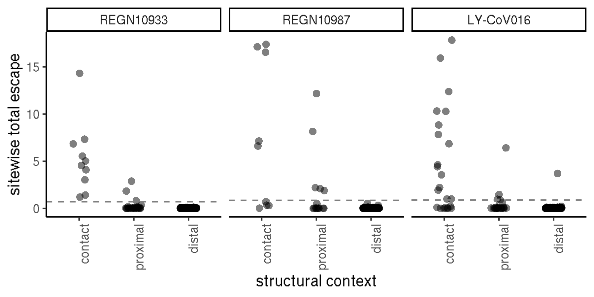

Custom analyses clinical mAbs
================
Tyler Starr
11/17/2020

-   [Data input and formatting](#data-input-and-formatting)
-   [Part 1: Circulating variants at the per-mut
    level](#part-1-circulating-variants-at-the-per-mut-level)
-   [Part 2: Double mutants in RBD
    alignment?](#part-2-double-mutants-in-rbd-alignment)
-   [Part 3: escape within or without the structural
    epitope](#part-3-escape-within-or-without-the-structural-epitope)

This notebook does some random analyses on the clinical antibodies set
that vary from the more constrained global pipeline.

    require("knitr")
    knitr::opts_chunk$set(echo = T)
    knitr::opts_chunk$set(dev.args = list(png = list(type = "cairo")))

    #list of packages to install/load
    packages = c("yaml","data.table","tidyverse","ggrepel","bio3d")
    #install any packages not already installed
    installed_packages <- packages %in% rownames(installed.packages())
    if(any(installed_packages == F)){
      install.packages(packages[!installed_packages])
    }
    #load packages
    invisible(lapply(packages, library, character.only=T))

    #read in config file
    config <- read_yaml("config.yaml")

    #read in escape profiles file
    profiles_config <- read_yaml(file=config$escape_profiles_config)

    #make output directory
    output_dir <- config$custom_plots_dir
    if(!file.exists(output_dir)){
      dir.create(file.path(output_dir))
    }

Session info for reproducing environment:

    sessionInfo()

    ## R version 3.6.2 (2019-12-12)
    ## Platform: x86_64-pc-linux-gnu (64-bit)
    ## Running under: Ubuntu 18.04.4 LTS
    ## 
    ## Matrix products: default
    ## BLAS/LAPACK: /app/software/OpenBLAS/0.3.7-GCC-8.3.0/lib/libopenblas_haswellp-r0.3.7.so
    ## 
    ## locale:
    ##  [1] LC_CTYPE=en_US.UTF-8       LC_NUMERIC=C              
    ##  [3] LC_TIME=en_US.UTF-8        LC_COLLATE=en_US.UTF-8    
    ##  [5] LC_MONETARY=en_US.UTF-8    LC_MESSAGES=en_US.UTF-8   
    ##  [7] LC_PAPER=en_US.UTF-8       LC_NAME=C                 
    ##  [9] LC_ADDRESS=C               LC_TELEPHONE=C            
    ## [11] LC_MEASUREMENT=en_US.UTF-8 LC_IDENTIFICATION=C       
    ## 
    ## attached base packages:
    ## [1] stats     graphics  grDevices utils     datasets  methods   base     
    ## 
    ## other attached packages:
    ##  [1] bio3d_2.4-0       ggrepel_0.8.1     forcats_0.4.0     stringr_1.4.0    
    ##  [5] dplyr_0.8.3       purrr_0.3.3       readr_1.3.1       tidyr_1.0.0      
    ##  [9] tibble_3.0.2      ggplot2_3.3.0     tidyverse_1.3.0   data.table_1.12.8
    ## [13] yaml_2.2.0        knitr_1.26       
    ## 
    ## loaded via a namespace (and not attached):
    ##  [1] tidyselect_1.1.0 xfun_0.11        haven_2.2.0      colorspace_1.4-1
    ##  [5] vctrs_0.3.1      generics_0.0.2   htmltools_0.4.0  rlang_0.4.7     
    ##  [9] pillar_1.4.5     glue_1.3.1       withr_2.1.2      DBI_1.1.0       
    ## [13] dbplyr_1.4.2     modelr_0.1.5     readxl_1.3.1     lifecycle_0.2.0 
    ## [17] munsell_0.5.0    gtable_0.3.0     cellranger_1.1.0 rvest_0.3.5     
    ## [21] evaluate_0.14    parallel_3.6.2   fansi_0.4.0      broom_0.7.0     
    ## [25] Rcpp_1.0.3       scales_1.1.0     backports_1.1.5  jsonlite_1.6    
    ## [29] fs_1.3.1         hms_0.5.2        digest_0.6.23    stringi_1.4.3   
    ## [33] grid_3.6.2       cli_2.0.0        tools_3.6.2      magrittr_1.5    
    ## [37] crayon_1.3.4     pkgconfig_2.0.3  ellipsis_0.3.0   xml2_1.2.2      
    ## [41] reprex_0.3.0     lubridate_1.7.4  assertthat_0.2.1 rmarkdown_2.0   
    ## [45] httr_1.4.1       rstudioapi_0.10  R6_2.4.1         compiler_3.6.2

Data input and formatting
-------------------------

Read in escape fractions, rename some things to make them easier to work
with.

    scores <- data.table(read.csv(file=config$escape_fracs,stringsAsFactors=F))

    scores <- scores[selection %in% names(profiles_config$`REGN_and_LY-CoV016`$conditions) & library=="average", .(selection,condition,site,protein_site,wildtype,mutation,mut_escape_frac_epistasis_model,site_total_escape_frac_epistasis_model)]

    setnames(scores,"mut_escape_frac_epistasis_model","mut_escape_frac");setnames(scores,"site_total_escape_frac_epistasis_model","site_total_escape")

    scores[,antibody:=as.character(profiles_config$`REGN_and_LY-CoV016`$conditions[condition])]

    scores <- scores[,.(antibody,site,protein_site,wildtype,mutation,mut_escape_frac,site_total_escape)]

    scores[,site_max_escape:=max(mut_escape_frac,na.rm=T),by=c("antibody","site")]

Part 1: Circulating variants at the per-mut level
-------------------------------------------------

Current notebook on circulating mutations considers all mutations at a
site together, regardless of the escape conferred by the particular
mutation that is circulating. With the clinical mAbs, in addition to the
sitewise diversity (e.g. as an indicator of what sites can accommodate
diversity), we might be interested in the specific mutations themselves
that are circulating, as that could have a direct effect on antibody
therapies. Furthermore, we want to collate circulating variants at
structural contact positions for antibodies, to see if there is any
interesting difference in circulating variants at contact positions that
do *not* facilitate escape from the antibody.

We read in table reporting circulating variants. We add new columns to
our data frame indicating the nobs and frequency on GISAID, and the
number of countries in which a mutant has been observed. Then, First,
for each antibody, we plot per-mutation escape fraction versus frequency
(log10), with a ‘pseudo-frequency’ of 0.1x the lowest actual frequency,
to enable log10 plotting)

    #read in table giving mutant frequencies on GISAID
    counts <- read.csv(config$gisaid_mutation_counts,stringsAsFactors=F)
    #add to scores table
    scores[,count:=0];scores[,n_countries:=0];scores[,frequency:=0]
    for(i in 1:nrow(counts)){
      scores[protein_site==counts[i,"site"] & mutation==counts[i,"mutant"],count:=counts[i,"count"]]
      scores[protein_site==counts[i,"site"] & mutation==counts[i,"mutant"],n_countries:=counts[i,"n_countries"]]
      scores[protein_site==counts[i,"site"] & mutation==counts[i,"mutant"],frequency:=counts[i,"frequency"]]
    }

    #set factor order for antibodies
    scores$antibody <- factor(scores$antibody,levels=c("REGN10933","REGN10987","REGN10933 + REGN10987","LY-CoV016"))

    scores[,pseudo_frequency:=frequency]
    scores[frequency==0,pseudo_frequency:=0.1*min(scores[frequency>0,frequency])]

    p1 <- ggplot(scores)+aes(x=pseudo_frequency,y=mut_escape_frac)+
      geom_point(shape=16, alpha=0.5, size=2.25)+
      facet_wrap(~antibody,nrow=1)+
      scale_x_continuous(trans="log10")+
      scale_y_continuous(limits=c(0,1.05))+
      theme_classic()+
      xlab('mutant frequency on GISAID (log10 scale)')+
      ylab('mutant escape fraction')+
      geom_text_repel(aes(label=ifelse((mut_escape_frac>0.15 & frequency>1e-6) | (mut_escape_frac>0.05 & frequency>1e-3),as.character(paste(wildtype,protein_site,mutation,sep="")),'')),size=3,color="gray40")
    p1

    invisible(dev.print(pdf, paste(output_dir,"/circ-mut-scatter_mAbs_REGN-LY.pdf",sep="")))

Part 2: Double mutants in RBD alignment?
----------------------------------------

Want to know whether any sequences in the alignment of RBD sequences
from GISAID have double mutants, and if so, whether any are dual escape
from cocktail components.

    #read in RBD alignment
    alignment <- bio3d::read.fasta(file="results/GISAID_mutations/RBD_alignment.fasta", rm.dup=F)

    #read in 'reference' sequence
    reference <- bio3d::read.fasta(file="results/GISAID_mutations/reference_RBD.fasta")

    #iterate through alignment (dumb, but effective), save index/id for any genotype that has multiple RBD mutations
    multiples_id <- c()
    multiples_ndiff <- c()
    multiples_muts <- c()
    for(i in 1:nrow(alignment$ali)){
      diff <- 0
      muts <- c()
      for(j in 1:ncol(alignment$ali)){
        if(alignment$ali[i,j] != reference$ali[1,j] & !(alignment$ali[i,j] %in% c("X","-"))){
          diff <- diff+1
          muts <- c(muts,paste(reference$ali[1,j],j+330,alignment$ali[i,j],sep=""))
        }
      }
      if(diff>1){
        print(i)
        multiples_id <- c(multiples_id,alignment$id[i])
        multiples_ndiff <- c(multiples_ndiff, diff)
        multiples_muts <- c(multiples_muts,list(muts))
      }
    }

    ## [1] 4860
    ## [1] 6962
    ## [1] 7671
    ## [1] 8361
    ## [1] 9755
    ## [1] 12350
    ## [1] 14898
    ## [1] 15449
    ## [1] 16009
    ## [1] 17777
    ## [1] 18542
    ## [1] 19502
    ## [1] 19857
    ## [1] 20654
    ## [1] 21058
    ## [1] 23191
    ## [1] 24351
    ## [1] 24856
    ## [1] 25754
    ## [1] 25921
    ## [1] 27576
    ## [1] 27891
    ## [1] 29373
    ## [1] 30141
    ## [1] 30183
    ## [1] 32333
    ## [1] 32706
    ## [1] 32724
    ## [1] 34079
    ## [1] 36862
    ## [1] 42532
    ## [1] 43196
    ## [1] 44016
    ## [1] 45887
    ## [1] 47265
    ## [1] 48563
    ## [1] 49490
    ## [1] 51474
    ## [1] 51567
    ## [1] 54737
    ## [1] 54926
    ## [1] 56265
    ## [1] 57072
    ## [1] 59851
    ## [1] 61477
    ## [1] 63746
    ## [1] 64287
    ## [1] 66101
    ## [1] 67389
    ## [1] 67537
    ## [1] 69089
    ## [1] 69590
    ## [1] 69716
    ## [1] 69743
    ## [1] 72984
    ## [1] 74099
    ## [1] 74832
    ## [1] 77237
    ## [1] 77788
    ## [1] 78022
    ## [1] 80603
    ## [1] 83105
    ## [1] 84053
    ## [1] 85818
    ## [1] 86178
    ## [1] 86684
    ## [1] 91302
    ## [1] 92673
    ## [1] 93159
    ## [1] 94024
    ## [1] 95340
    ## [1] 95800
    ## [1] 100389
    ## [1] 100731
    ## [1] 102587
    ## [1] 103321
    ## [1] 104293
    ## [1] 106517
    ## [1] 106620
    ## [1] 109855
    ## [1] 110415
    ## [1] 110812
    ## [1] 113994
    ## [1] 114544
    ## [1] 115084
    ## [1] 116811
    ## [1] 117227
    ## [1] 119219
    ## [1] 121845
    ## [1] 122456
    ## [1] 125608
    ## [1] 127983
    ## [1] 130414
    ## [1] 134189
    ## [1] 136598
    ## [1] 137499
    ## [1] 138011
    ## [1] 139462
    ## [1] 148288
    ## [1] 148639
    ## [1] 151509
    ## [1] 151787
    ## [1] 153041
    ## [1] 153627
    ## [1] 154749
    ## [1] 157567
    ## [1] 158319
    ## [1] 159148
    ## [1] 161650
    ## [1] 163904
    ## [1] 164823
    ## [1] 165329
    ## [1] 165547
    ## [1] 166702
    ## [1] 167320
    ## [1] 167635
    ## [1] 168070
    ## [1] 169559
    ## [1] 170440
    ## [1] 172070
    ## [1] 172096
    ## [1] 173433
    ## [1] 173547
    ## [1] 173572
    ## [1] 174362
    ## [1] 176227
    ## [1] 178936
    ## [1] 178969
    ## [1] 178996

    multiples <- data.frame(id=multiples_id,n=multiples_ndiff)
    for(i in 1:nrow(multiples)){
      multiples$muts[i] <- list(multiples_muts[i][[1]])
    }

    #make single 'mutant' column in scores data frame
    scores[,mutant:=paste(wildtype,protein_site,mutation,sep="")]
      
    #iterate through, and list the maximum REGN10933 and REGN10987 escape fracs for the listed mutations
    for(i in 1:nrow(multiples)){
      muts <- multiples[i,"muts"][[1]]
      escapes_REGN10933 <- scores[mutant %in% muts & antibody=="REGN10933",mut_escape_frac]
      escapes_REGN10987 <- scores[mutant %in% muts & antibody=="REGN10987",mut_escape_frac]
      multiples$max_REGN10933[i] <- max(escapes_REGN10933,na.rm=T)
      multiples$max_REGN10987[i] <- max(escapes_REGN10987,na.rm=T)
    }

    ## Warning in max(escapes_REGN10933, na.rm = T): no non-missing arguments to max;
    ## returning -Inf

    ## Warning in max(escapes_REGN10987, na.rm = T): no non-missing arguments to max;
    ## returning -Inf

    ## Warning in max(escapes_REGN10933, na.rm = T): no non-missing arguments to max;
    ## returning -Inf

    ## Warning in max(escapes_REGN10987, na.rm = T): no non-missing arguments to max;
    ## returning -Inf

    ## Warning in max(escapes_REGN10933, na.rm = T): no non-missing arguments to max;
    ## returning -Inf

    ## Warning in max(escapes_REGN10987, na.rm = T): no non-missing arguments to max;
    ## returning -Inf

    ## Warning in max(escapes_REGN10933, na.rm = T): no non-missing arguments to max;
    ## returning -Inf

    ## Warning in max(escapes_REGN10987, na.rm = T): no non-missing arguments to max;
    ## returning -Inf

    plot(multiples$max_REGN10933,multiples$max_REGN10987,pch=16,xlab="max escape from REGN10933",ylab="max escape from REGN10987",col="#00000067")

Part 3: escape within or without the structural epitope
-------------------------------------------------------

We want to try a few plots – at the per-mut and per-site level, compare
distribution of escape scores between structural contacts and
non-contacts. We should try the contact/non-contact, but also a “close”
category corresponding to 4-8A distance? Means we’ll probably want to
re-do the structural analysis here within this “custom analyses” script.

First, load pdbs, and generate list of residues that are &lt;4A or 4-8A
from each mAb

    pdb_REGN <- read.pdb(file="data/pdbs/6xdg.pdb")

    ##    PDB has ALT records, taking A only, rm.alt=TRUE

    pdb_CB6 <- read.pdb(file="data/pdbs/7c01_single.pdb")

    contacts_REGN10933_4A <- binding.site(pdb_REGN, 
                                          a.inds=atom.select(pdb_REGN, chain="E"),
                                          b.inds=atom.select(pdb_REGN,chain=c("B","D")),
                                          cutoff=4,hydrogens=F)$resno
    contacts_REGN10933_4to8A <- binding.site(pdb_REGN, 
                                          a.inds=atom.select(pdb_REGN, chain="E"),
                                          b.inds=atom.select(pdb_REGN,chain=c("B","D")),
                                          cutoff=8,hydrogens=F)$resno
    contacts_REGN10933_4to8A <- contacts_REGN10933_4to8A[!(contacts_REGN10933_4to8A %in% contacts_REGN10933_4A)]

    contacts_REGN10987_4A <- binding.site(pdb_REGN, 
                                          a.inds=atom.select(pdb_REGN, chain="E"),
                                          b.inds=atom.select(pdb_REGN,chain=c("A","C")),
                                          cutoff=4,hydrogens=F)$resno
    contacts_REGN10987_4to8A <- binding.site(pdb_REGN, 
                                          a.inds=atom.select(pdb_REGN, chain="E"),
                                          b.inds=atom.select(pdb_REGN,chain=c("A","C")),
                                          cutoff=8,hydrogens=F)$resno
    contacts_REGN10987_4to8A <- contacts_REGN10987_4to8A[!(contacts_REGN10987_4to8A %in% contacts_REGN10987_4A)]

    contacts_CB6_4A <- binding.site(pdb_CB6, 
                                          a.inds=atom.select(pdb_CB6, chain="A"),
                                          b.inds=atom.select(pdb_CB6,chain=c("H","L")),
                                          cutoff=4,hydrogens=F)$resno
    contacts_CB6_4to8A <- binding.site(pdb_CB6, 
                                          a.inds=atom.select(pdb_CB6, chain="A"),
                                          b.inds=atom.select(pdb_CB6,chain=c("H","L")),
                                          cutoff=8,hydrogens=F)$resno
    contacts_CB6_4to8A <- contacts_CB6_4to8A[!(contacts_CB6_4to8A %in% contacts_CB6_4A)]

Next, make jitterplots showing site total escape for the three
categories of structural class.

    temp <- scores[antibody %in% c("LY-CoV016","REGN10987","REGN10933"),]
    #add column whether a site is in direct contact, proximal, or distal to interface
    temp[,contact:="distal"]
    temp[antibody=="LY-CoV016" & protein_site %in% contacts_CB6_4A,contact:="contact"]
    temp[antibody=="LY-CoV016" & protein_site %in% contacts_CB6_4to8A,contact:="proximal"]
    temp[antibody=="REGN10933" & protein_site %in% contacts_REGN10933_4A,contact:="contact"]
    temp[antibody=="REGN10933" & protein_site %in% contacts_REGN10933_4to8A,contact:="proximal"]
    temp[antibody=="REGN10987" & protein_site %in% contacts_REGN10987_4A,contact:="contact"]
    temp[antibody=="REGN10987" & protein_site %in% contacts_REGN10987_4to8A,contact:="proximal"]
    temp$contact <- factor(temp$contact,levels=c("contact","proximal","distal"))

    #add value indicating the heuristic cutoff for "strong" escape for each mAb
    cutoff_LYCoV016 <- max(5*median(temp[antibody=="LY-CoV016",site_total_escape]),0.05*max(temp[antibody=="LY-CoV016",site_total_escape]))
    cutoff_REGN10933 <- max(5*median(temp[antibody=="REGN10933",site_total_escape]),0.05*max(temp[antibody=="REGN10933",site_total_escape]))
    cutoff_REGN10987 <- max(5*median(temp[antibody=="REGN10987",site_total_escape]),0.05*max(temp[antibody=="REGN10987",site_total_escape]))

    temp[antibody=="LY-CoV016",cutoff:=cutoff_LYCoV016]
    temp[antibody=="REGN10933",cutoff:=cutoff_REGN10933]
    temp[antibody=="REGN10987",cutoff:=cutoff_REGN10987]

    #sitewise
    ggplot(unique(temp[,.(antibody,protein_site,site_total_escape,contact)]),aes(x=contact,y=site_total_escape))+
      geom_jitter(width=0.15, alpha=0.5,height=0,size=2.25,shape=16)+
      geom_hline(data=unique(temp[,.(antibody,cutoff)]),aes(yintercept=cutoff),linetype="dashed",color="gray50")+
      theme_classic()+
      theme(axis.text.x=element_text(angle=90,hjust=1))+
      xlab("structural context")+ylab("sitewise total escape")+
      facet_wrap(~antibody,nrow=1)

    invisible(dev.print(pdf, paste(output_dir,"/escape_by_contact_type.pdf",sep="")))

Table with number of sites in each structural category, and number of
sites of “strong” escape

    temp <- unique(temp[,.(antibody,protein_site,site_total_escape,contact,cutoff)])

    dt <- data.frame(antibody=c("REGN10933","REGN10987","LY-CoV016"),n_contact=NA,n_contact_escape=NA,n_proximal=NA,n_proximal_escape=NA,n_distal=NA,n_distal_escape=NA)
    for(i in 1:nrow(dt)){
      dt$n_contact[i] <- nrow(temp[as.character(antibody)==dt[i,"antibody"] & contact=="contact",])
      dt$n_contact_escape[i] <- nrow(temp[as.character(antibody)==dt[i,"antibody"] & contact=="contact" & site_total_escape>cutoff,])
      dt$n_proximal[i] <- nrow(temp[as.character(antibody)==dt[i,"antibody"] & contact=="proximal",])
      dt$n_proximal_escape[i] <- nrow(temp[as.character(antibody)==dt[i,"antibody"] & contact=="proximal" & site_total_escape>cutoff,])
      dt$n_distal[i] <- nrow(temp[as.character(antibody)==dt[i,"antibody"] & contact=="distal",])
      dt$n_distal_escape[i] <- nrow(temp[as.character(antibody)==dt[i,"antibody"] & contact=="distal" & site_total_escape>cutoff,])
    }
    kable(dt)

| antibody  | n\_contact | n\_contact\_escape | n\_proximal | n\_proximal\_escape | n\_distal | n\_distal\_escape |
|:----------|-----------:|-------------------:|------------:|--------------------:|----------:|------------------:|
| REGN10933 |         10 |                 10 |          26 |                   3 |       138 |                 0 |
| REGN10987 |          9 |                  5 |          15 |                   5 |       150 |                 0 |
| LY-CoV016 |         23 |                 15 |          23 |                   4 |       128 |                 1 |
